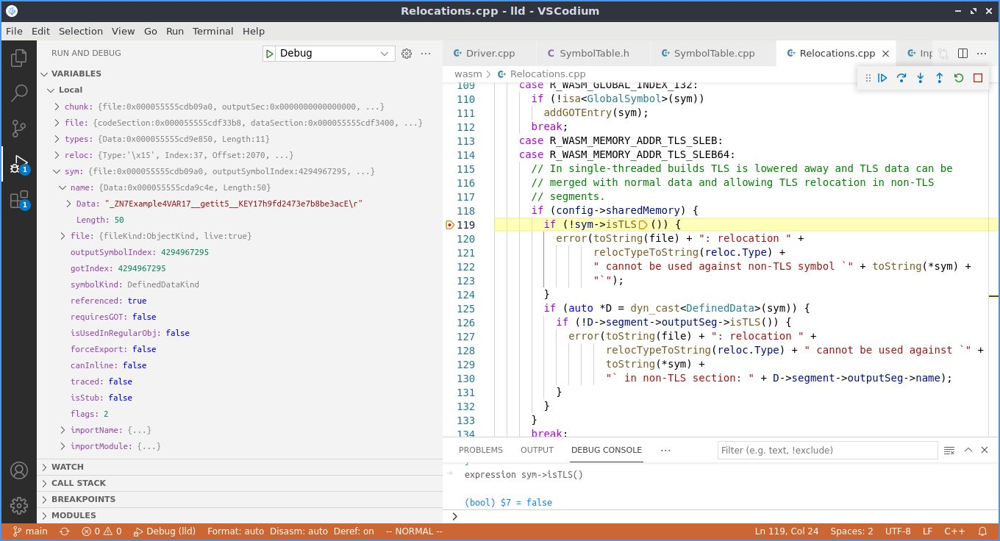

# Threa local storage link issue with Rust/wasm-ld/Emscripten

This repository is a small example to help narrow down the cause of a problem
which occurs when trying to enable threads on a Rust program compiling to the
`wasm32-unknown-emscripten` target.  It compiles, but fails with a `wasm-ld`
linker error. I've extracted the failing `wasm-ld` command that has yields the
error, an placed it in the file [linker_command.sh](./linker_command.sh), which
I've tried to ensure you can use without having to deal with Rust (or even have
Rust installed).  All of the compiled [object files are
included](./target/wasm32-unknown-emscripten/debug/deps/) in this repository.
The [error](./error.txt) can be seen in the snippet below, with additional
information provided by the `--verbose` option.  (Before running the script,
you will have to set a couple of variable at the top of the script to point to
your installation of emsdk and wasm-ld)

    <snip a lot of "Processing" lines>

    lld: -- createOutputSegments
    lld: -- createSyntheticSections
    lld: -- layoutMemory
    lld: mem: global base = 1024
    lld: mem: .tdata          offset=1024     size=72       align=2
    lld: mem: .rodata         offset=1104     size=41484    align=4
    lld: mem: .data           offset=42592    size=348      align=3
    lld: mem: .bss            offset=42944    size=3184     align=4
    lld: mem: __wasm_init_memory_flag offset=46128    size=4        align=4
    lld: mem: static data = 45108
    lld: mem: stack size  = 5242880
    lld: mem: stack base  = 46144
    lld: mem: stack top   = 5289024
    lld: mem: heap base   = 5289024
    lld: mem: total pages = 256
    lld: mem: max pages   = 256
    lld: -- createSyntheticSectionsPostLayout
    lld: -- populateProducers
    lld: -- calculateImports
    lld: -- scanRelocations
    lld: error: /home/greg/rust-examples/tls/target/wasm32-unknown-emscripten/debug/deps/Example.1b0wam0nd5eghoka.rcgu.o: 
        relocation R_WASM_MEMORY_ADDR_TLS_SLEB cannot be used against non-TLS symbol `Example::VAR1::__getit::__KEY::h9fd2473e7b8be3ac`
    
    <snip more errors of the same nature>

    lld: -- finalizeIndirectFunctionTable
    lld: -- populateTargetFeatures
    lld: -- createSyntheticInitFunctions
    lld: -- assignIndexes
    lld: -- calculateInitFunctions

...note the lack of a `.tbss` section reported above, but there is a `.tdata`
and a `.bss` section.  The error message indicates that the symbols in question
are not marked as thread local storage, but when using `wasm-objdump`, it seems
like there are signs that the symbols are a part of thread local storage.  With
the `-x` option (raw output in [dump-x.txt](./other/dump-x.txt) and [dump-x_rustfilt.txt](./other/dump-x_rustfilt.txt)):  

    $ wasm-objdump -x ./target/wasm32-unknown-emscripten/debug/deps/Example.1b0wam0nd5eghoka.rcgu.o | rustfilt

    Data[14]:
    <snip>
     - segment[13] <.tbss.Example::VAR1::__getit::__KEY> memory=0 size=12 - init i32=156
      - 000009c: 0000 0000 0000 0000 0000 0000            ............
    <snip>
    Custom:
     - name: "linking"
      - symbol table [count=52]
    <snip>
       - 37: D <Example::VAR1::__getit::__KEY> segment=13 offset=0 size=12 [ binding=local vis=default ]
    <snip>
      - segment info [count=14]
       - 0: .rodata..L__unnamed_8 p2align=0 [ ]
       - 1: .rodata..L__unnamed_2 p2align=2 [ ]
       - 2: .rodata..L__unnamed_3 p2align=2 [ ]
       - 3: .rodata..L__unnamed_9 p2align=0 [ ]
       - 4: .rodata..L__unnamed_10 p2align=0 [ ]
       - 5: .rodata..L__unnamed_4 p2align=2 [ ]
       - 6: .rodata..L__unnamed_1 p2align=2 [ ]
       - 7: .rodata..L__unnamed_11 p2align=0 [ ]
       - 8: .rodata..L__unnamed_5 p2align=2 [ ]
       - 9: .rodata..L__unnamed_12 p2align=0 [ ]
       - 10: .rodata..L__unnamed_6 p2align=2 [ ]
       - 11: .rodata..L__unnamed_13 p2align=0 [ ]
       - 12: .rodata..L__unnamed_7 p2align=2 [ ]
       - 13: .tbss.Example::VAR1::__getit::__KEY p2align=2 [ TLS ]
    Custom:
     - name: "reloc.CODE"
      - relocations for section: 5 (Code) [70]
    <snip>
       - R_WASM_MEMORY_ADDR_TLS_SLEB offset=0x000816(file=0x000e9a) symbol=37 <Example::VAR1::__getit::__KEY>
    <snip>

     - name: "reloc..debug_info"
      - relocations for section: 8 (.debug_info) [242]
     <snip>
       - R_WASM_MEMORY_ADDR_I32 offset=0x000043(file=0x003910) symbol=37 <Example::VAR1::__getit::__KEY>

...you will notice segment 13 has .tbss mentioned and with `wasm-objdump -d -r` ([dump-d.txt](./other/dump-d.txt) and [dump-d_rustfilt.txt](./other/dump-d_rustfilt.txt)):

    $ wasm-objdump -d -r ./target/wasm32-unknown-emscripten/debug/deps/Example.1b0wam0nd5eghoka.rcgu.o | rustfilt

    <snip>
    000e99: 41 9c 81 80 80 00          | i32.const 156
              000e9a: R_WASM_MEMORY_ADDR_TLS_SLEB 37 <Example::VAR1::__getit::__KEY>
    000e9f: 21 00                      | local.set 0
    000ea1: 23 81 80 80 80 00          | global.get 1 <env.__tls_base>
              000ea2: R_WASM_GLOBAL_INDEX_LEB 18 <env.__tls_base>

(where the files ending in [rustfilt](https://github.com/luser/rustfilt) have
been passed through the rust name demangler).

The `wasm-ld` error message comes from `scanRelocations` function in [Relocations.cpp](https://github.com/llvm/llvm-project/blob/304d30bc594bf99bba9ee780007ac78755a9ff7a/lld/wasm/Relocations.cpp#L120-L123) at line #120.  


That function uses the [isTLS()](https://github.com/llvm/llvm-project/blob/2899e8de67aae052e6c93b95a2fd152c86e0aefc/lld/wasm/Symbols.cpp#L213) method, which uses `WASM_SYMBOL_TLS`. There
are only a select few places where that flag appears:

    /emsdk/llvm/git/src$ find . -type f \( -name "*.h" -o -name "*.cpp" \) -exec grep -H  WASM_SYMBOL_TLS {} \;
      ./lld/wasm/Symbols.cpp:bool Symbol::isTLS() const { return flags & WASM_SYMBOL_TLS; }
      ./lld/wasm/InputFiles.cpp:      flags |= WASM_SYMBOL_TLS;
      ./llvm/include/llvm/BinaryFormat/Wasm.h:const unsigned WASM_SYMBOL_TLS = 0x100;
      ./llvm/include/llvm/MC/MCSymbolWasm.h:  bool isTLS() const { return getFlags() & wasm::WASM_SYMBOL_TLS; }
      ./llvm/include/llvm/MC/MCSymbolWasm.h:    modifyFlags(wasm::WASM_SYMBOL_TLS, wasm::WASM_SYMBOL_TLS);
      ./llvm/lib/MC/WasmObjectWriter.cpp:      Flags |= wasm::WASM_SYMBOL_TLS;

...the one from
[InputFiles.cpp](https://github.com/llvm/llvm-project/blob/main/lld/wasm/InputFiles.cpp)
is part of the
[ObjFile::createDefined](https://github.com/llvm/llvm-project/blob/1eb5b6e85045d22720f177a02aaf7097930e4b4f/lld/wasm/InputFiles.cpp#L581-L587)
method which has the following:

```C
      case WASM_SYMBOL_TYPE_DATA: {
        InputChunk *seg = segments[sym.Info.DataRef.Segment];
        auto offset = sym.Info.DataRef.Offset;
        auto size = sym.Info.DataRef.Size;
        if (seg->implicitTLS) {
          flags |= WASM_SYMBOL_TLS;
    }
```
...and when you look at where `seg->implicitTLS` gets [set](https://github.com/llvm/llvm-project/blob/1eb5b6e85045d22720f177a02aaf7097930e4b4f/lld/wasm/InputFiles.cpp#L478-L485):

```C
    // Older object files did not include WASM_SEG_FLAG_TLS and instead
    // relied on the naming convention.  To maintain compat with such objects
    // we still imply the TLS flag based on the name of the segment.
    if (!seg->isTLS() &&
        (seg->name.startswith(".tdata") || seg->name.startswith(".tbss"))) {
      seg->flags |= WASM_SEG_FLAG_TLS;
      seg->implicitTLS = true;
    }
```

...but when stepping through the code with the debugger, I see that
`seg->isTLS()` appears to be [true for the
segment](./images/seg.isTLS_after.jpg) that the
`Example::VAR1::__getit::__KEY::h9fd2473e7b8be3ac` symbol is in, so it doesn't
set the implicitTLS flag, and thus presumably wouldn't set the `flags |=
WASM_SYMBOL_TLS;` and therefore isTLS() wouldn't ever be true on the symbol
itself, and you always would get the linker error in Relocations.cpp.  The
"flags" for that symbol are 2 as can be seen from the screenshot above.  But
the "always failing" assumption must be false, since Emscripten can work with
thread local data, as shown by this [C program](/src/c_example), which does
essentially the same thing as the Rust program, and uses both `.tdata` and
`.tbss` sections without issue (see the [example
assembly](/src/c_example/example.s) below) (build by using `make wasm` in that
directory (and see the other targets)).

        .type	variable1,@object               # @variable1
        .section	.tdata.variable1,"T",@
        .globl	variable1
        .p2align	2
    variable1:
        .int32	1                               # 0x1
        .size	variable1, 4

        .type	variable2,@object               # @variable2
        .section	.tbss.variable2,"T",@
        .globl	variable2
        .p2align	2
    variable2:
        .int32	0                               # 0x0
        .size	variable2, 4

...*and* the fact that there are other symbols that are marked as
"R_WASM_MEMORY_ADDR_TLS_SLEB" in the rust originated object file, but that
don't report linking problems.  From the '-x' wasm-objdump file:

   - 17: D <__THREW__> [ undefined binding=global vis=default ]
   <snip>
    Custom:
     - name: "reloc.CODE"
      - relocations for section: 5 (Code) [70]
       - R_WASM_MEMORY_ADDR_TLS_SLEB offset=0x0006c5(file=0x000d49) symbol=17 <__THREW__>

I thought it might be related to the [this
issue](https://github.com/emscripten-core/emscripten/pull/14982#issuecomment-909735685)
which sounds like there was a problem because the debug symbols weren't part of
the thread local storage, but the same link error occurs when building without
debugging symbols. (The object files for the `--release` build are [here](/target/wasm32-unknown-emscripten/release/deps/) as
well). 

Anyone have thoughts on a good place to start diving into this issue more?  If
there is another more appropriate place to ask the question, please let me
know.

The versions of the various programs:

    $ wasm-ld --version
    LLD 14.0.0

    $ wasm-objdump --version
    1.0.25

    $ rustc +nightly --version
    rustc 1.59.0-nightly (efec54529 2021-12-04)

To generate the object files from the rust source, compile the stub:

    cd src
    em++ -c gxx_personality_v0_stub.cpp -pthread

...and then invoke the command:

    cargo +nightly build --target=wasm32-unknown-emscripten -Z build-std=panic_abort,std

(If anyone is interested stepping through wasm-ld, there is also a vscode
[launch configuration file](./other/launch.json) in the repository that will
help with setting the arguments to lld, but you'll need to edit it to reflect
the location the object files on your computer.)

